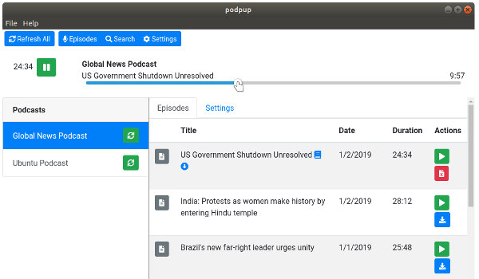

# Using Podpup

### Starting Up
When you start up podpup, it's going to be pretty bare. There's a toolbar at the top for options to refresh podcasts, displaying episodes, searching for podcasts, and viewing application settings. Below that is the player which is currently not doing anything. Then there is the space for listing podcasts and showing either the podcast episodes or the podcast settings.


### Subscribing to Podcasts
There's not much to do without any podcasts, so let's subscribe to a couple. Click on the 'search' button on the toolbar to bring up the search screen.


There are two ways of adding a podcast. The top option allows you to directly enter the URL for the RSS feed of a podcast like: http://highrollersdnd.libsyn.com/rss 

That's not a very easy way to add podcasts so the second option is to do a search. Type in your search term(s) and click the search button. Here, the search is for 'BBC' and you can see that a good number of podcasts have been found. To subscribe to one of them, click on the subscribe button.

### Viewing, Downloading, and Playing Episodes

After adding another podcast about Ubuntu, it's time to actually to look at the episodes. Click on the 'episodes' button on the toolbar to look at episodes.

Note: At some point you'll be able to just select a podcast to switch over to episodes, but, you know, pre-alpha.


### View Podcast Episodes
After clicking on the 'episodes' button of the toolbar, the episodes display comes up, but no episodes will be shown until a podcast is selected.


Click on a podcast to select it and the episodes for that podcast will appear.


If you want to see episode details, then click on the details icon. This will also reveal the 'hide' button which will hide an episode from display if you have no interest in it.


You can also download the episode by clicking on the download button.


Once the episode has been downloaded, the icon for downloading will change to the 'remove download' icon which can be used for, as you guessed, removing the downloaded file. You'll also notice that a downloaded badge has appeared next to the episode title. 

Now let's play the episode. The episode will play regardless if it has been downloaded or not. If it hasn't been downloaded, then the audio will be streamed.


When a episode is playing, you may use the play/pause button in the player to pause the playback and restart it again. You can also drag the play progress slider to move to a new position in the playback.



You'll also see that a book icon appears next to the episode title. This indicates that the episode's current location has been bookmarked. If you stop playback by playing a difference episode or closing the application, then you will start at your last location the next time you play it.

### Refreshing Podcasts
Podpup doesn't automatically check for new episodes yet, but it's easy to tell podpup to check. In order to check for all podcasts, click on the 'refresh all' button on the toolbar. The refresh button on each podcast will turn into a spinner until podpup is done checking the feed.


You can also refresh a single podcast at a time by clicking on the podcast's refresh button.


### Unsubscribing from Podcasts

When a podcast is selected, there is a settings tab in addition to the episodes tab. The settings tab has a button for unsubscribing from the podcast. Unsubscribing will remove the podcast from the podcasts list, but won't delete the downloaded files which remain in your podpup data directory.


From the settings page you are also able to unhide all the episodes in the podcast if you wish to.

### Changing the Podpup Data Directory

By default, Podpup will keep everything podcast related in a data directory named 'podpop' which is created in you home directory. There is nothing in the UI for changing this directory, but it can be changed in the podpup.config file which will be located in your application settings directory in the 'podpup' folder. On Linux this folder will be at ~/.config/podpop. If the podpup.config file isn't present, create it and add the line:

```
datadir=[directory you want to use]
```
