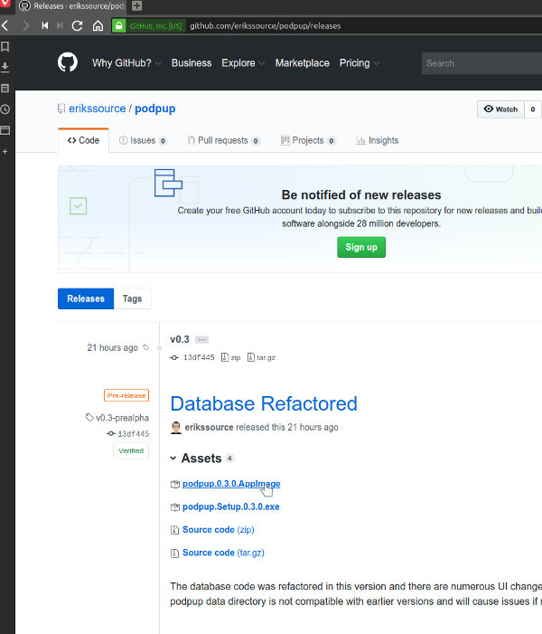

# Podpup

## User Guide
Go to the quick guide to using Podpup

[Using Podpup](GUIDE.md)

## v0.3 Notes
v0.3 is still considered pre-alpha so the feature set is pretty bare and there are open issues.

## Getting Podpup
Currently, there are binaries available for both Linux and Windows and they can be downloaded from Podpup's Github page: http://github.com/erikssource/podpup

Click on releases to see the versions available.

Currently, the latest release is v0.3-prealpha. You'll see that in addition to the source code bundles there is a AppImage file and a .exe file. The AppImage file is for running on Linux and the .exe is for installing on Windows. Click on the appropriate link to download.

#### Windows
The podpup.Setup.x.x.x.exe file is an installer, so it will install podpup when it is run. Once finished, Poppup will be added to your available applications.

#### Linux
Beforing running the AppImage file, you'll need to set the permissions on the file to be executable. Once that's done, you can start Podpup by running the AppImage file. You'll be given an option to integrate Podpup with your desktop if you want to which will add it to the available applications for the current user.
